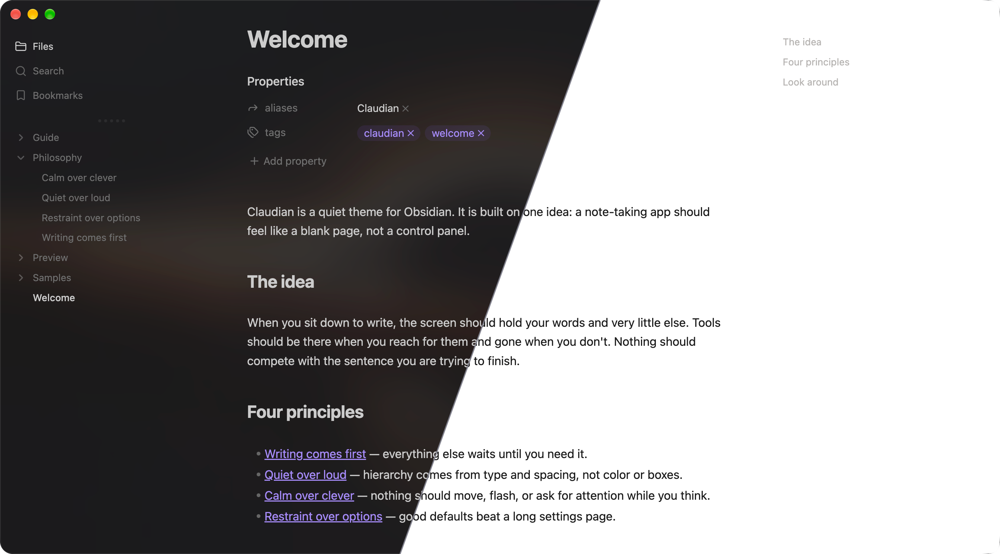
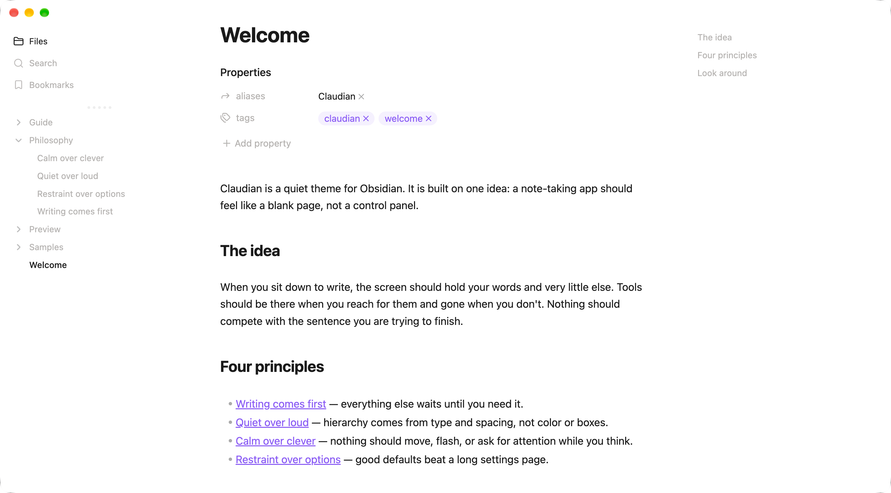
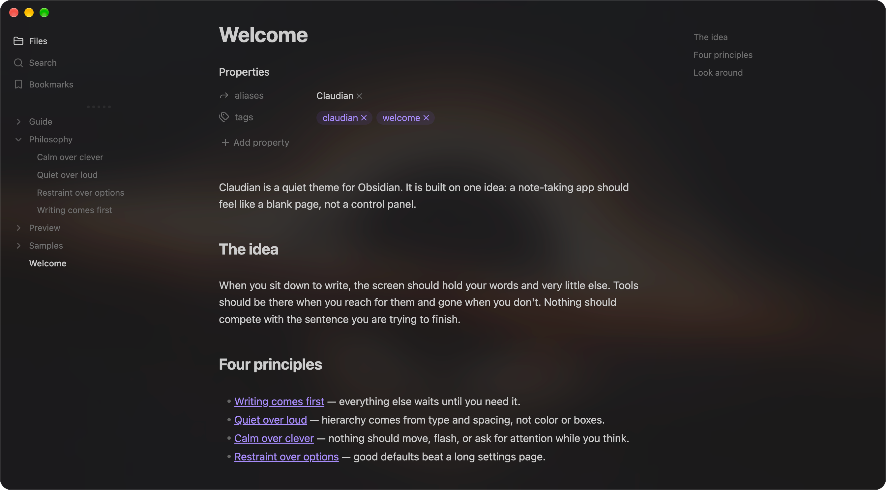

# Claudian

A quiet Obsidian theme where your writing comes first and the interface stays out of the way.

Full light and dark screenshots

## Philosophy

A note-taking app should feel like a blank page, not a control panel.

- **Writing comes first.** Everything else waits until you need it.
- **Quiet over loud.** Hierarchy comes from type and spacing, not color or boxes.
- **Calm over clever.** Nothing should move, flash, or ask for attention while you think.
- **Restraint over options.** Good defaults beat a long settings page.

## Install

1. Create a `Claudian` folder inside your vault's `.obsidian/themes/` directory.
2. Copy `theme.css` and `manifest.json` into it.
3. In Obsidian, open **Settings → Appearance → Themes** and select **Claudian**.

Requires Obsidian 1.13.7 or later. For translucent dark mode, turn on **Settings → Appearance → Translucent window** (macOS and Windows).

## Settings

With the [Style Settings](https://github.com/mgmeyers/obsidian-style-settings) plugin, open **Style Settings → Claudian** to adjust:

- **Background Opacity**: how translucent dark mode is (default 30%).
- **Hide Tab Bar**: Dynamic (default), Always, or Never.
- Heading level markers, header hashtags, image captions, and link underlines.
- De-emphasized file properties and embedded backlinks.
- Visibility of the right sidebar button.

## Development

Edit the files in `src/`, then run `npm run build` (Node.js, no dependencies) to regenerate `theme.css`.

- `src/base.css`: colors, typography, editor, and Style Settings.
- `src/left-sidebar.css`: the left sidebar, tabs, and file tree.
- `src/vault-snippets.css`: tables, scrollbars, tab underline, right-sidebar icons, and status bar.
- `screenshots/`: README images; `screenshot.png` in the root is the 512×288 image for the Obsidian theme directory.

## Releasing

1. Update `version` in `manifest.json` and `package.json` (format `x.y.z`), then run `npm run build`.
2. Commit, then push a tag with the same version, for example `git tag 0.1.0 && git push origin 0.1.0`.
3. The release workflow checks the tag against `manifest.json` and publishes a GitHub release with `theme.css` and `manifest.json` attached.

## License and credits

Claudian is released under the [MIT License](LICENSE), © 2026 Yishen Tu.

Claudian builds on the work of two MIT-licensed Obsidian themes. Their copyright notices are kept in `licenses/` and embedded in `theme.css`:

- **[Meridian](https://github.com/mvahaste/meridian)** by mvahaste (v1.19.1): the foundation for colors, typography, and the editor. Meridian is itself derived from Apex. [License](licenses/Meridian.txt)
- **[Baseline](https://github.com/svnaxis/obsidian-baseline)** by svnaxis (v4.0.0): the left sidebar and tab layout. [License](licenses/Baseline.txt)

Thank you to both authors.
